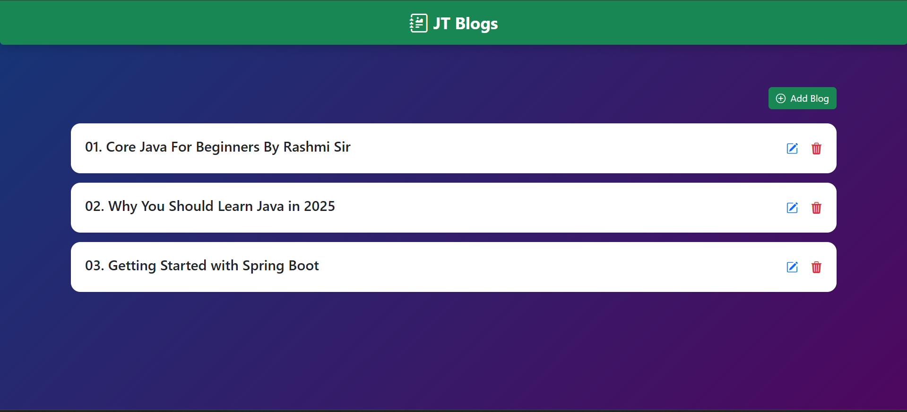
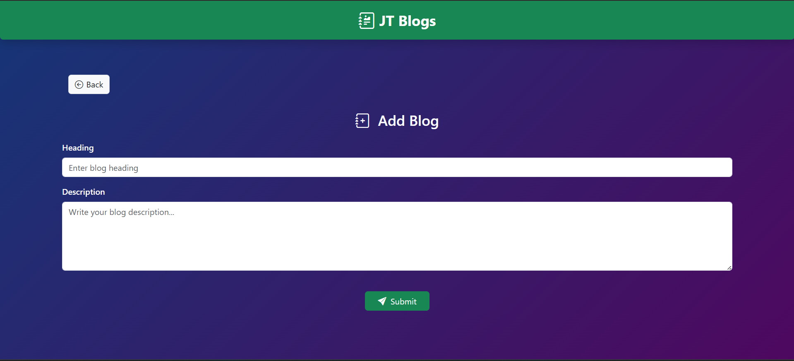
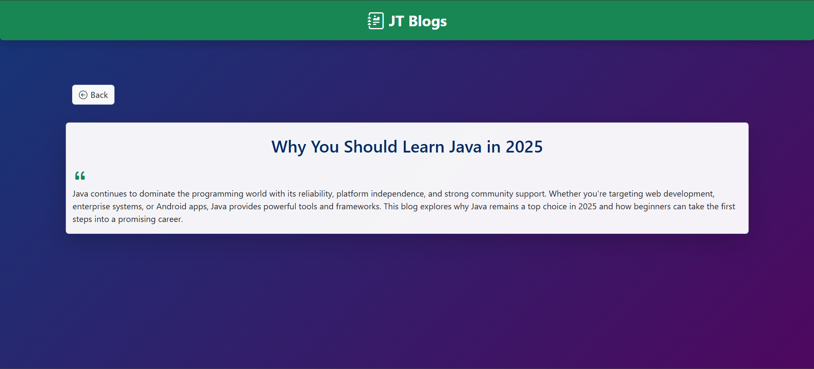

# 📝 JT-Blog

A clean and professional blog management system built using **Java**, **Spring Boot**, **Thymeleaf**, and **Bootstrap 5**. This project allows users to create, edit, view, and delete blog posts with an elegant UI and utilizing database technology for smooth interactions.

<br>


## 📸 Project Preview

Home page


Add Page


Edit Page


<br>

## 🚀 Features

- Add, Edit, View, and Delete blog posts
- Blog list with hover effects, icons, and modern design
- Responsive and professional UI using Bootstrap 5
- Custom styling and dynamic blog ID prefix (01., 02., etc.)
- Organized folder structure with clean separation of concerns
<br>

## 🛠️ Tech Stack

- **Java 17+**
- **Spring Boot**
- **Thymeleaf**
- **MySQL**
- **HTML**
- **CSS**
- **Bootstrap 5**
- **JavaScript**
- **Maven**
- **HTML / CSS**
- **Maven**

<br>

## 📂 Project Structure

```

JT-BLOG/
│
├── src/
│   └── main/
│       ├── java/com/jt/jt\_blog/
│       │   ├── controller/          # BlogController.java
│       │   ├── model/               # Blog.java
│       │   ├── service/             # BlogService.java
│       │   └── JtBlogApplication.java
│       │
│       ├── resources/
│       │   ├── static/js/           # home.js
│       │   └── templates/
│       │       ├── common/          # fragment.html
│       │       ├── add-blog.html
│       │       ├── blog-detail.html
│       │       ├── edit-blog.html
│       │       └── home.html
│       │
│       └── application.yml
│
├── pom.xml
└── README.md

````

<br>

## 🧪 How to Run

1. **Clone the repo**
   ```bash
   git clone https://github.com/your-username/jt-blog.git
   cd jt-blog


2. **Open in your IDE** (IntelliJ recommended)

3. **Start the application**

   * Run `JtBlogApplication.java` as a Spring Boot app

4. **Visit in browser**

   ```
   http://localhost:8080/
   ```


