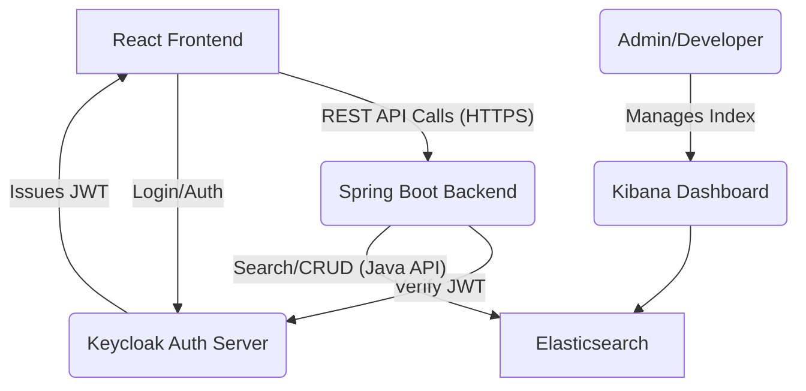

# Restaurant Review & Search Platform (Backend)

This project is the complete backend for a modern restaurant review and search application. It is built with **Spring Boot** and leverages **Elasticsearch** for powerful, real-time fuzzy and geospatial search. User authentication and API security are managed by **Keycloak**.

## 🚀 Core Features

* **Secure Authentication:** Full user registration, login, and token-based authentication handled by **Keycloak (OAuth2/OIDC)**.
* **Role-Based Access:** API endpoints are secured based on user roles (e.g., only authenticated users can post reviews).
* **Full CRUD API:** Complete RESTful API for creating, reading, updating, and deleting restaurants and reviews.
* **🔎 Dynamic Fuzzy Search:** Uses **Elasticsearch** for smart, typo-tolerant search on restaurant names and cuisine types.
* **🗺️ Geospatial Search:** Find restaurants within a specific radius using Elasticsearch's `geo_distance` queries.
* **🐳 Containerized Environment:** The entire stack (Elasticsearch, Kibana) is managed with **Docker Compose** for easy setup and data persistence.

## 🛠️ Tech Stack

| Category | Technology |
| :--- | :--- |
| **Backend** | Spring Boot, Spring Security |
| **Database** | Elasticsearch |
| **Security** | Keycloak (OAuth2/OIDC) |
| **Containerization**| Docker, Docker Compose, Docker Volumes |
| **Management** | Kibana (for Elasticsearch) |
| **Data Mapping** | MapStruct |

## 📐 System Architecture

This application follows a modern, decoupled architecture. The Spring Boot backend acts as the central API, handling all business logic and delegating security to Keycloak and data persistence to Elasticsearch.



### Application Structure

The Spring Boot application itself is organized into a clean, layered architecture:

* **`config`**: Holds the `SecurityConfig` for Keycloak and JWT validation.
* **`controllers`**: REST API layer for handling all incoming HTTP requests.
* **`domain/dtos`**: Data Transfer Objects (DTOs) used for API request/response payloads.
* **`domain/entities`**: Core data models (documents) that are stored in Elasticsearch.
* **`services`**: Business logic layer that orchestrates data and operations.
* **`repositories`**: Spring Data Elasticsearch repository for database queries.
* **`mappers`**: MapStruct interfaces for clean, boilerplate-free conversion between DTOs and entities.

## 🏁 Getting Started

To get a local copy up and running, follow these steps.

### Prerequisites

You will need the following tools installed on your system:

* **Java 19** (or newer)
* **Maven**
* **Docker Desktop**

### Installation & Running

1.  **Clone the repository:**

    ```bash
    git clone https://github.com/Rakesh0045/Spring_Boot_Practise.git
    cd restaurant-review-platform/restaurant-review-backend
    ```

2.  **Start External Services:**
    This project requires Elasticsearch and Kibana. A `docker-compose.yml` file is provided for you.

    ```bash
    docker-compose up -d
    ```

    * Elasticsearch will be available at `http://localhost:9200`.
    * Kibana will be available at `http://localhost:5601`.

3.  **Configure Keycloak:**

    * You must have a Keycloak server running (you can use Docker or a local binary).
    * Create a new **realm** (e.g., `restaurant-realm`).
    * Create a new **client** (e.g., `restaurant-review-app`) with your frontend's URL (`http://localhost:3000`) as a valid redirect URI.
    * Update the `application.properties` file in `src/main/resources/` with your Keycloak details:
      ```properties
      spring.security.oauth2.resourceserver.jwt.issuer-uri=http://localhost:9090/realms/your-realm-name
      ```

4.  **Run the Spring Boot Application:**

    ```bash
    mvn spring-boot:run
    ```

    The API will be live at `http://localhost:1202`.

## 📖 API Endpoints

Here are the main endpoints provided by the API:

<details>
  <summary><strong>Restaurant Endpoints (Click to expand)</strong></summary>


| Method | Endpoint                 | Description                                      |
|--------|---------------------------|--------------------------------------------------|
| POST   | /api/restaurants          | Creates a new restaurant (Authenticated users).  |
| GET    | /api/restaurants          | Searches for restaurants (Fuzzy, Geo, Rating).   |
| GET    | /api/restaurants/{id}     | Gets details for a single restaurant.            |
| PUT    | /api/restaurants/{id}     | Updates a restaurant (Admin/Owner).              |
| DELETE | /api/restaurants/{id}     | Deletes a restaurant (Admin/Owner).              |

</details>


<details>
  <summary><strong>Review Endpoints (Click to expand)</strong></summary>


| Method | Endpoint                                    | Description                               |
|--------|----------------------------------------------|-------------------------------------------|
| POST   | /api/restaurants/{restaurantId}/reviews      | Posts a new review.                       |
| GET    | /api/restaurants/{restaurantId}/reviews      | Gets all reviews for a restaurant.        |
| PUT    | /api/reviews/{reviewId}                      | Updates your own review (within 48 hrs).  |
| DELETE | /api/reviews/{reviewId}                      | Deletes your own review.                  |

</details>
