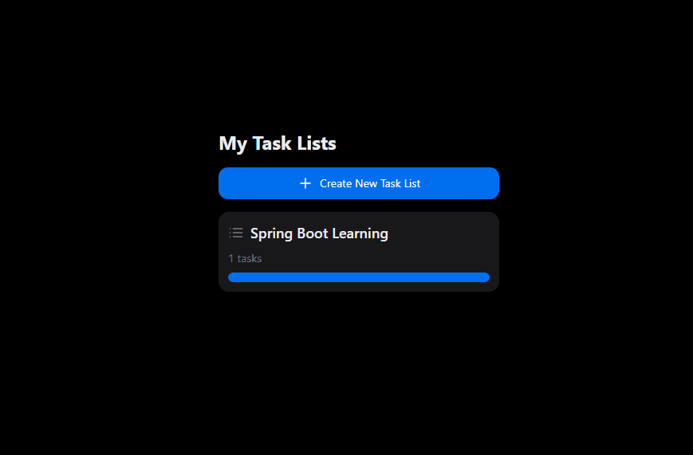

# 🗓️ **TaskMaster Pro: A Full-Stack Task Management App**
<br>

<div align="center">


</div>

<br>

TaskMaster Pro is a modern full-stack task management app that helps you plan projects, organize tasks, and track progress efficiently. It’s built to demonstrate a complete development cycle — from setup to cloud deployment — using a scalable, production-grade architecture.

<br>

## 🌐 [Live Demo](https://spring-task-tracker.netlify.app/) 👉 https://spring-task-tracker.netlify.app/ 

<br>

### 🎬 **App Preview**


<br>

## 📋 Key Features

-   **Modern UI/UX:** Built with NextUI and Tailwind CSS for a clean, responsive interface.
-   **Smart Organization:** Create multiple task lists for different projects or goals.
-   **Full CRUD Operations:** Create, view, edit, and delete tasks and lists easily.
-   **Progress Tracking:** Each list shows a dynamic progress bar for quick visual feedback.
-   **Cloud Deployed:** Fully hosted and accessible via Netlify, Render, and Neon.

<br>

## 🛠️ Tech Stack & Architecture

| Layer      | Technologies                                                                   |
| ---------- | ------------------------------------------------------------------------------ |
| **Frontend** | React, TypeScript, Vite, NextUI, Tailwind CSS, Axios                           |
| **Backend** | Java 17, Spring Boot 3, Spring Data JPA, Hibernate, Maven                      |
| **Database** | PostgreSQL                                                                     |
| **Deployment** | Docker (containerization), Render (Backend), Netlify (Frontend), Neon (Database) |

<br>

## 🚧 Local Setup Guide

Follow these steps to run TaskMaster Pro on your local machine.

<br>

### 🧩 Prerequisites

-   Java JDK 17+
-   Node.js v18+ and npm
-   Docker Desktop
<br>


### 1. Clone the Repository

```bash
git clone [https://github.com/Rakesh0045/Spring_Boot_Practise.git](https://github.com/Rakesh0045/Spring_Boot_Practise.git)
cd Spring_Boot_Practise/task-tracker-app
````
<br>

### 2\. Run the Backend

First, start a PostgreSQL database instance using Docker:

```bash
docker run --name postgres-task-db -e POSTGRES_PASSWORD=Rakesh -p 5432:5432 -d postgres
```
<br>

Next, navigate to the backend directory and run the Spring Boot application:

```bash
cd task-tracker-backend
./mvnw spring-boot:run
```
<br>

The backend API will now be running at `http://localhost:2801`.
<br>

### 3\. Run the Frontend

Open a **new terminal** and navigate to the frontend directory:

```bash
cd task-tracker-frontend
npm install
npm run dev
```
<br>

The frontend application will be available at `http://localhost:5173`. The Vite proxy is pre-configured to communicate with your local backend.

<br>


## 📦 Environment Variables

For local development, the proxy handles the connection. For a production build, you'll need to configure environment variables.


**Backend (`application.properties`):**
Spring Boot uses `application.properties` for configuration. The default is set up for the local Docker command above.
<br>


```properties
SPRING_DATASOURCE_URL=jdbc:postgresql://localhost:5432/postgres
SPRING_DATASOURCE_USERNAME=
SPRING_DATASOURCE_PASSWORD=
```
<br>


**Frontend (`.env.production`):**
Create a `.env.production` file for your deployed frontend.

```
VITE_API_BASE_URL=[https://your-live-backend-url.com](https://your-live-backend-url.com)
```

<br>


## 🧠 Learning Highlights

  - End-to-end full-stack development with React and Spring Boot.
  - REST API design and integration using Axios.
  - Database management with PostgreSQL, JPA, and Hibernate.
  - Containerization with Docker for consistent environments.
  - Cloud deployment workflows for Netlify, Render, and Neon.

<br>


## 👤 Author

**Rakesh Kumar Parida**

  * **GitHub**: [@Rakesh0045](https://github.com/Rakesh0045)

If you liked this project, please consider giving it a ⭐ on GitHub\!
